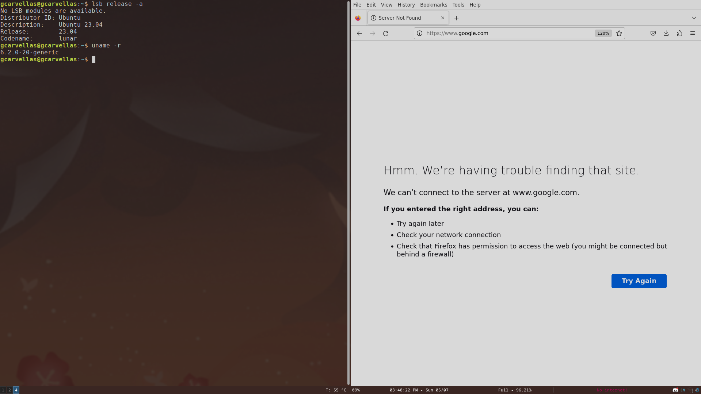

# Dotfiles

## Requirements

- Arch Linux
- i3 v4.22
- i3blocks
- dunst v1.9.0
- brillo v1.4.12 https://gitlab.com/cameronnemo/brillo
- Font Awesome 6
- pipewire (and it's alsa/pulse translation layers)
- kitty term
- feh v3.9.1
- picom vgit-b700a
- dmenu-5.2
- Font Awesome 6
- Nerd Fonts
- network-manager-applet 1.32.0
- xdotool-3.20211022.1-1
- pacman-contrib
- wireless_tools-30.pre9-3
- sysstat-12.7.2-1
- ananicy
- auto-cpufreq

## Optional

- vscode
- neovim

- https://github.com/yurikhan/kitty_grab

## VSCode plugins
- Noctis Bordo: https://vscodethemes.com/e/liviuschera.noctis/noctis-bordo?language=javascript
- GlassIt-VSC: https://marketplace.visualstudio.com/items?itemName=s-nlf-fh.glassit

## Images

## References

- https://gitlab.com/Nmoleo/i3-volume-brightness-indicator
- https://github.com/altindas/dots
- https://github.com/Melkeydev/vscode_bindings
