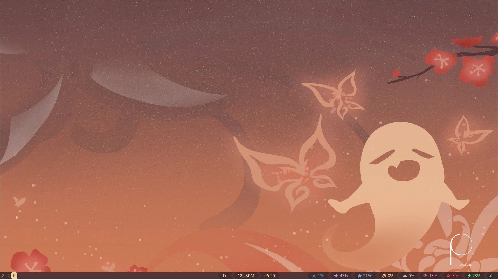

# Dotfiles

## Requirements

- i3 v4.22
- dunst v1.9.0
- brillo v1.4.12 https://gitlab.com/cameronnemo/brillo
- Font Awesome 6
- powerprofilesctl 0.12
- pactl 16.1
- gnome terminal 3.48.0

## Images

## References

- https://gitlab.com/Nmoleo/i3-volume-brightness-indicator
- https://github.com/altindas/dots
